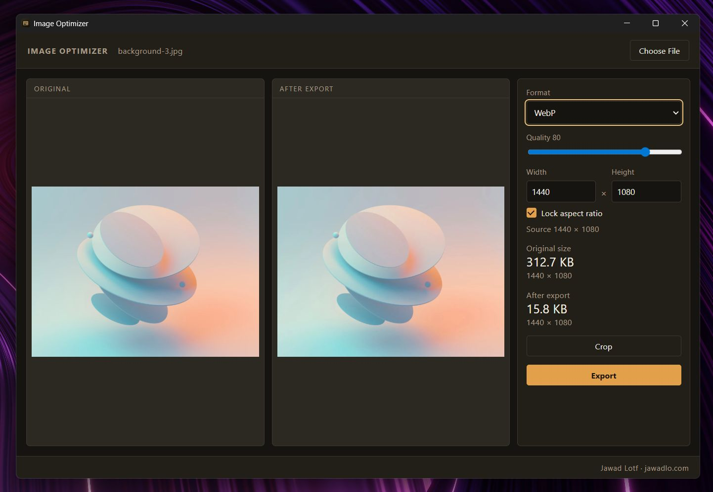

# Image Optimizer

A private desktop app that compresses one image at a time — on your computer, not in the cloud.

Open a photo, crop it if you want, pick a format and quality, then export a smaller file.

<p align="center">
  
</p>


## Why use it?

- **Nothing is uploaded.** Encoding happens locally with [sharp](https://sharp.pixelplumbing.com/).
- **See the result before you save.** Original on the left, compressed preview on the right, with the real file size.
- **Simple controls.** Format, quality, resize, and crop — nothing extra.
- **Safe export.** Save As never overwrites your original unless you choose that file yourself.

## Features

- Open **JPEG, PNG, WebP, BMP, or GIF** (first frame)
- **Crop** with a freeform rectangle
- Convert to **JPEG, PNG, or WebP**
- **Quality** slider from 10 to 100 (default 80)
- **Resize** width and height, with optional aspect-ratio lock
- **Flatten** transparent pixels onto a color when exporting JPEG
- One image at a time — opening another file replaces the current one

## How to compress an image

1. **Open a file** — click **Choose File**, or drag an image onto the window.
2. **Compare** — the left pane is the original; the right pane is the compressed preview and its size.
3. **Crop (optional)** — click **Crop**, draw a rectangle, then **Done**. Use **Reset crop** to go back to the full image.
4. **Tune the output**
   - **Format** — JPEG, PNG, or WebP. The default matches your source file (BMP and GIF become PNG).
   - **Quality** — lower = smaller file. JPEG and WebP use encoder quality; PNG uses lossless compression effort.
   - **Width × Height** — change the output size. Lock aspect ratio to keep proportions.
   - **Flatten color** — only appears when the image has transparency and you export JPEG (default is white). PNG and WebP keep transparency.
5. **Export** — click **Export**, then pick where to save. The suggested name is `{filename}-optimized.{ext}`. Cancel leaves everything as it is.

That is the whole workflow. Open → adjust → export.

## Requirements

- Node.js 20 or later
- npm
- Windows, macOS, or Linux

## Run it locally

```bash
npm install
npm run dev
```

| Command | What it does |
| --- | --- |
| `npm run dev` | Start the app in development |
| `npm test` | Run tests |
| `npm run build:win` | Build a Windows installer |
| `npm run build:mac` | Build a macOS package |
| `npm run build:linux` | Build Linux packages |

Installers go to the `dist/` folder.

On Windows, install and run on the same machine so sharp’s native binary matches Electron.

## What it does not do

This app is intentionally small. It does **not** include batch folders, HEIC/AVIF, rotate/flip, filters, or silent overwrite of the original file.
